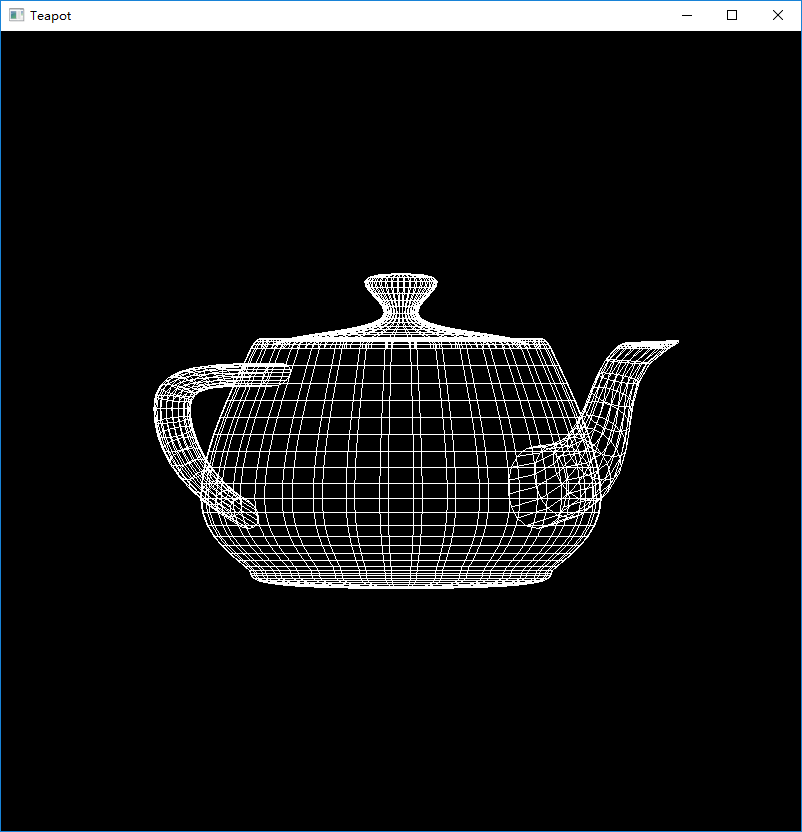

# 计算机图形学实验报告

## PJ1

### 环境

`python 3.7`

### 依赖

`librosa`+`matplotlib`+`numpy`

### 技术路线

使用librosa读入音频并进行stft，根据输出的振幅得到对应的分贝，而后分时进行输出。

使用matplotlib里的pyplot.bar显示对应柱状图，为进行实时显示，对上一阶段的输出进行降采样。

### 运行方式

`python PJ1.py filename.mp3`

or

`python PJ1.py` 默认运行`PJ1.mp3`

### 效果截图

## PJ2

### 环境

`python 3.7`

### 依赖

`pyopengl`

### 技术路线

调用pyopengl的接口，画一个茶壶，并加入一些旋转用于展示。

### 运行方式

`python PJ2.py`

### 效果截图

## PJ3

### 环境

`Adobe Animate CC`

### 技术路线

使用Adobe Animate的补间形状用于绘画直线，展示一个后现代抽象画的绘制过程

### 效果展示

